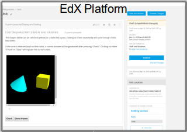
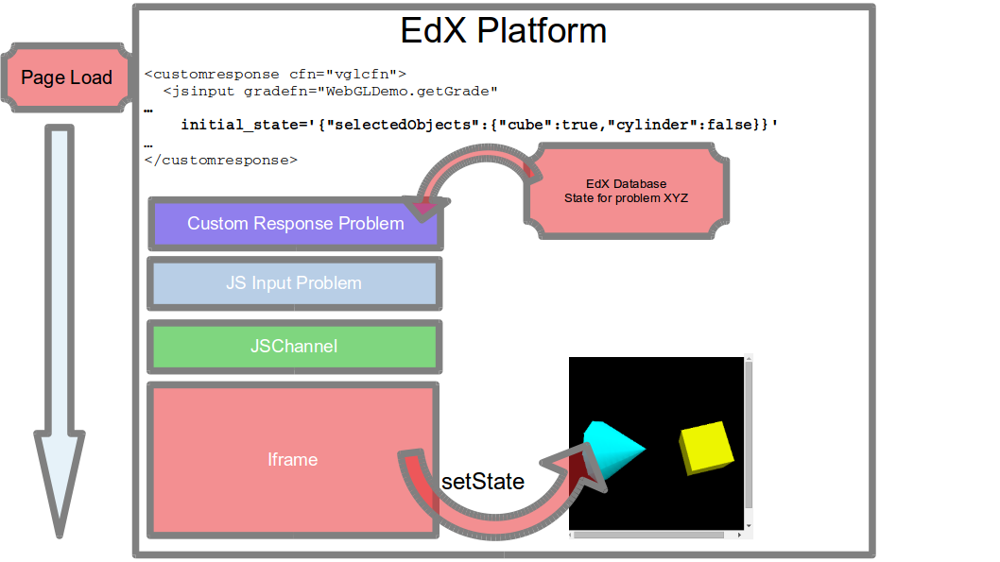
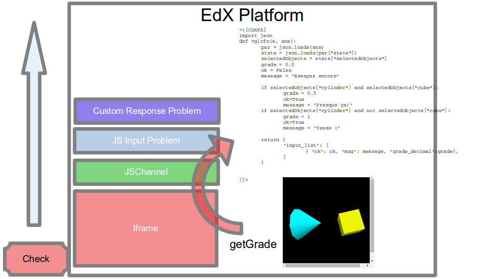
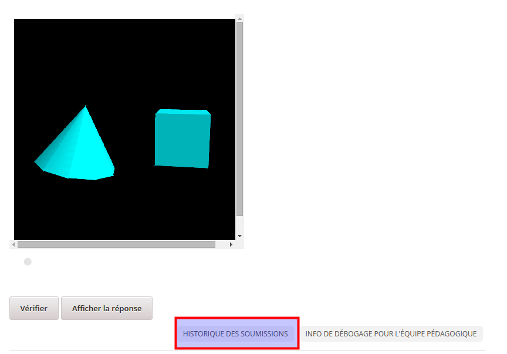

# Introduction

Une activité OpenedX peut aller de la simple page HTML, aux quiz et évaluations
par les pairs. Le JS-Input est une spécificité d'OpenedX permettant d'étendre
les types d'activités disponibles sur la plateforme.

Bien qu'OpenedX offre beaucoup de types d'activités différentes aux créateurs de
cours, "beaucoup" n'est souvent pas assez pour l'ensemble des acteurs de la plateforme.
Pour répondre à la demande des MOOC, ils faut souvent créer de multiple types
d'activités afin d'éviter l'aspect répétitif et permettre au cours d'être suivi
avec plus d'engouement. Il ne faut pas être limité à un choix toujours trop
réduit de types de quiz.

OpenedX propose de résoudre ce problème en mettant à portée du
développeur/concepteur deux technologies:
- Le Xblock (voir documentation spécifique): une extension en python qui doit
être installée sur le serveur qui héberge la plateforme. C'est probablement la
meilleure solution si vous avez accès au serveur.
- Le JS-Input: probablement moins flexible en terme de possibilité, mais
probablement la réponse à de nombreux besoins.  Le JS-Input a l'avantage d'être
une extension dont l'installation se fait directement dans un cours sans
nécéssiter un accès au serveur.

En gros une activité JS-Input c'est : une page HTML avec un peu de Javascript !

Dans ce document nous allons expliquer comment construire une simple application
JS-Input assez générique pour que vous compreniez les mécanismes de base.

# Les mécanismes de base

Tout d'abord, voici à quoi ressemble un problème de ce type dans studio:



Les paramètres de l'activité dans studio sont les suivants:
```
<problem>
       <script type="loncapa/python">
def all_true(exp, ans): return ans == "hi"
       </script>
       <customresponse cfn="all_true">
           <jsinput gradefn="gradefn"
               height="500"
               get_statefn="getstate"
               set_statefn="setstate"
               html_file="/static/jsinput.html"/>
       </customresponse>
</problem>
```

On peut en déduire que les étapes clés dans l'instanciation d'une activité JS-Input sont:
- Le chargement de l'activité et restauration de l'état intial: set_statefn
- Les actions de vérification du problème coté Open edX: gradefn
- Les actions de changement  : de note ou d'état get_statefn et gradefn

## Chargement de l'activité et initialisation de l'état

L'activité se charge dans la page de cours et utilise différents modules internes à Open edX.

Le module principal est "Custom Response Problem" qui est le module générique
dans Open edX, permettant d'évaluer une réponse de manière programmatique.
L'autre module est appelé JSChannel et permet à l'application JS-Input de
communiquer avec Open edX.
Nous allons revenir en détail vers ces deux modules dans un autre chapitre.

Pour l'instant occupons nous du processus décrit sur ce schéma:



Lorsque la page se charge, Open edX retouve le dernier état de l'application pour un
utilisateur donné. Cet état se présente sous la forme d'une information codée
en JSON. Le format de cette information est particulière à l'application
JS-Input (seule elle la comprend en réalité). Sa signification est définie par le créateur de l'activité.

Si aucun ""état" (JSON) pour l'utilisateur n'est trouvé et que l'on a spécifié un état initial, celui-ci est chargé et présenté à l'application JS-Input par un appel à la fonction "setState".


## Vérification du problème coté Open edX

La routine de vérification d'un problème est activée par l'appui de
l'utilisateur sur le bouton Vérifier (ou "Check" en Anglais). C'est seulement cette action qui déclenchera la séquence de vérifiction.

Ce qui se passe:
* Le conteneur JS Input Problem envoie un "Get grade" pour récupérer une l'information d'état de l'activité encodée en JSON. Il appellera aussi la fonction "Get State" si elle existe pour stocker l'état actuel de l'utilisateur.
* L'information passe à travers toutes les couches logicielles (JSChannel, JS Input Problem) et vers edX
* Le script python intégré à l'activité JS-Input dans Open edX est lancé pour vérifier le résultat, et renvoie une information sous forme de note.
* Le résultat est renvoyé vers le serveur edX



Ensuite le résultat est stocké dans la base de donnée Open edX avec des information sur le temps exact de soumission et ce que l'on appelle un 'correct_map' qui permet de stocker le status (correct ou non) de la réponse après analyse par le script python de l'exercice.

Vous pouvez voir l'historique des soumissions grâce au bouton "Historique des soumissions" situé au dessous de l'activité (seulement accessible par l'enseignant).



Cet historique va donner des résultats comme ceux-ci (application d'exemple Javascript):
```
#4: 2015-05-11 20:46:34+00:00 (Europe/Paris time)

Score: 1.0 / 1.0
{
  "attempts": 1,
  "correct_map": {
    "i4x-FUN-FUN101-problem-2d1cf6dd9012475ebf3d6295ccb1da72_2_1": {
      "correctness": "correct",
      "hint": "",
      "hintmode": null,
      "msg": "",
      "npoints": 1,
      "queuestate": null
    }
  },
  "done": true,
  "input_state": {
    "i4x-FUN-FUN101-problem-2d1cf6dd9012475ebf3d6295ccb1da72_2_1": {}
  },
  "last_submission_time": "2015-05-11T20:46:34Z",
  "seed": 1,
  "student_answers": {
    "i4x-FUN-FUN101-problem-2d1cf6dd9012475ebf3d6295ccb1da72_2_1": "{\"answer\":\"{\\\"cylinder\\\":true,\\\"cube\\\":false}\",\"state\":\"{\\\"selectedObjects\\\":{\\\"cylinder\\\":true,\\\"cube\\\":false}}\"}"
  }
}
```

## Mécanismes de retour d'information

Il existe un troisième mécanisme de retour d'information appelé get_statefn.
Dans la pratique, on peut se baser sur le retour de la note (qui peut donner bien plus qu'un état de note, mais aussi une idée de l'état de l'application).
Dans ce cas, on va pouvoir définir une fonction de l'application qui est appelée lorsque l'on requiers un status sur l'application. Dans ce cas la réponse de l'application devra comporter deux champs: answer et state.

Exemple:

```
{  
   "answer":"{"cylinder":true,"cube":false}",
   "state":"{"selectedObjects":{"cylinder":true,"cube":false}}"
}
```


# Les modules

## Custom Response Problem et JS Input Problem
Ces deux types de problèmes sont des modules permettant de vérifier la réponse utilisateur par un petit script python avant l'enregistrement réél sur Open edX.
Ceci permet de faire pas mal de choses notamment de noter de manière plus souple tout en restant automatique.

Documentation ici:
https://github.com/Stanford-Online/js-input-samples

## JSChannel

JSChannel est un wrapper créé par Mozilla pour faciliter la communication entre pages et iframes (voir window.postMessage: https://developer.mozilla.org/en-US/docs/Web/API/Window/postMessage ).
La bibliothèque JS Channel facilite ce travail: (https://github.com/mozilla/jschannel)

# Trucs et astuces

## Intégrer du JS Input directement de github

Lorsque l'on développe une extension, il est assez pratique de pouvoir avoir une version de l'application externe au cours sur un site externe. Sinon on est obligé de recharger les fichiers correspondants à chaque mise à jour.

Pour cela il est pratique d'utiliser le lien provenant directement de gihub sur les resources:

https://rawgit.com/


## Faire une activité qui retourne une note différente de 0 ou 1

```
<![CDATA[
import json
def vglcfn(e, ans):
	par = json.loads(ans)
  	state = json.loads(par["state"])
 	selectedObjects = state["selectedObjects"]
	grade = 0.0
	ok = False
	message = 'Essayez encore'

	if selectedObjects["cylinder"] and selectedObjects["cube"]:
		grade = 0.5
		ok=True
		message = 'Presque ça!'
	if selectedObjects["cylinder"] and not selectedObjects["cube"]:
		grade = 1
		ok=True
		message = 'Yesss !'

	return {
		'input_list': [
			{ 'ok': ok, 'msg': message, 'grade_decimal':grade},
		]
	}
]]>
```


## Liens utiles


Documentation de l'activité JS Input:
http://edx-partner-course-staff.readthedocs.org/en/latest/exercises_tools/custom_javascript.html

Documentation identique mais orientée développeur:
http://edxpdrlab.readthedocs.org/en/latest/course_data_formats/jsinput.html

Custom Python evaluated problem (Version générique du JS Input):
http://edx-partner-course-staff.readthedocs.org/en/latest/exercises_tools/custom_python.html

Stanford JS Input Samples:
https://github.com/Stanford-Online/js-input-samples
